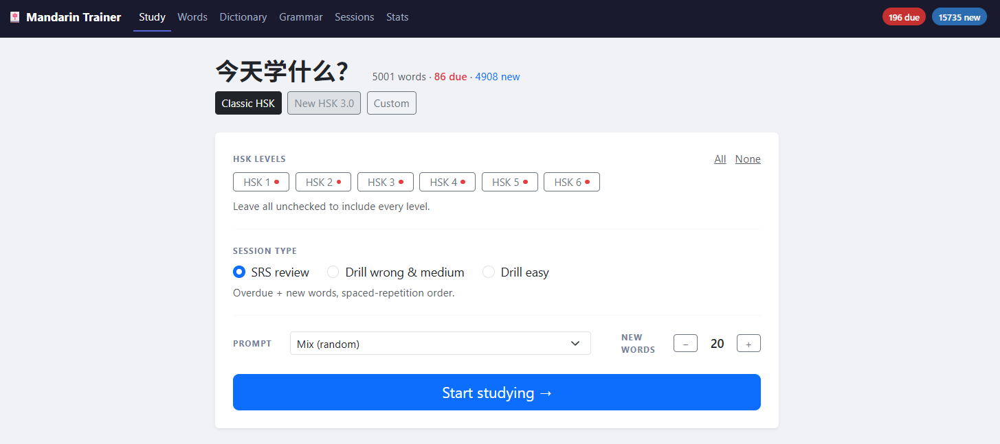
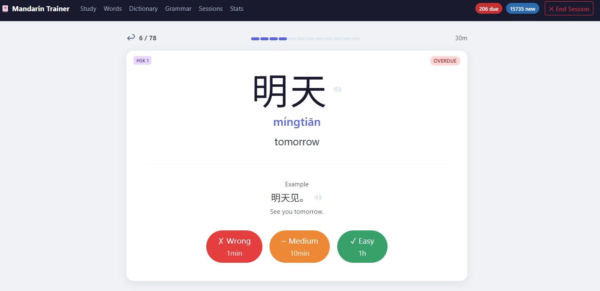
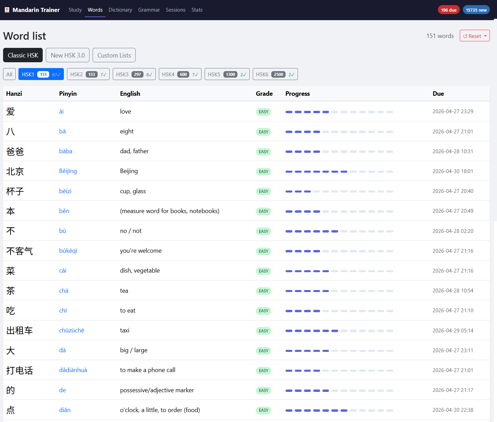
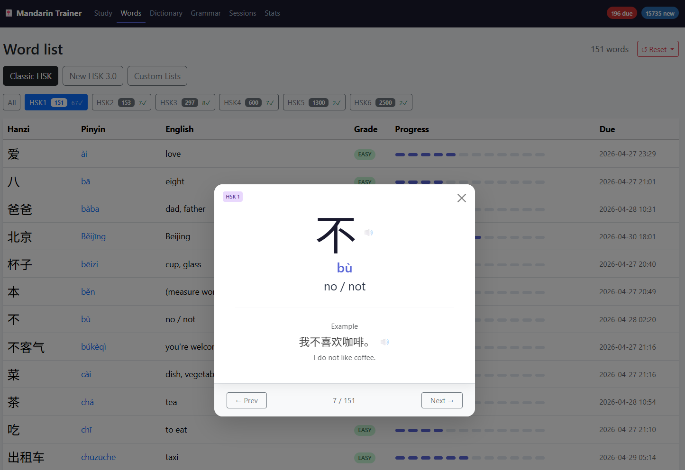
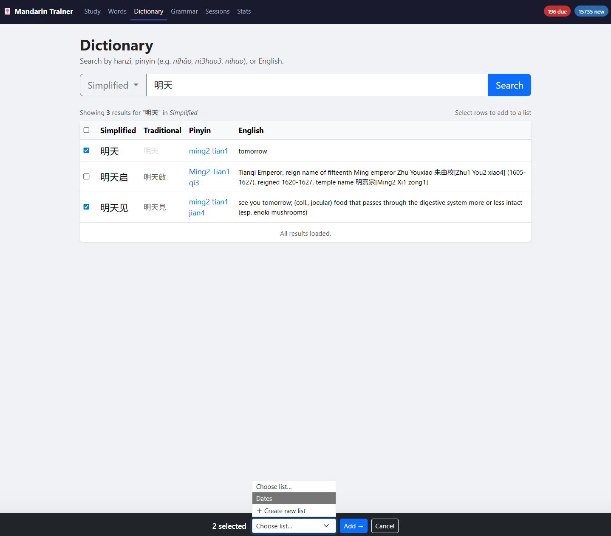
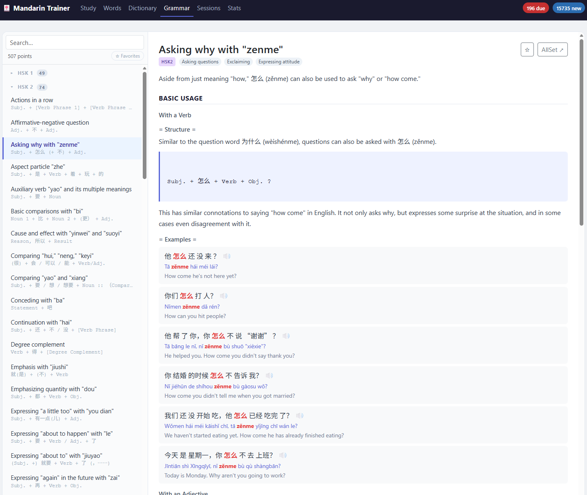
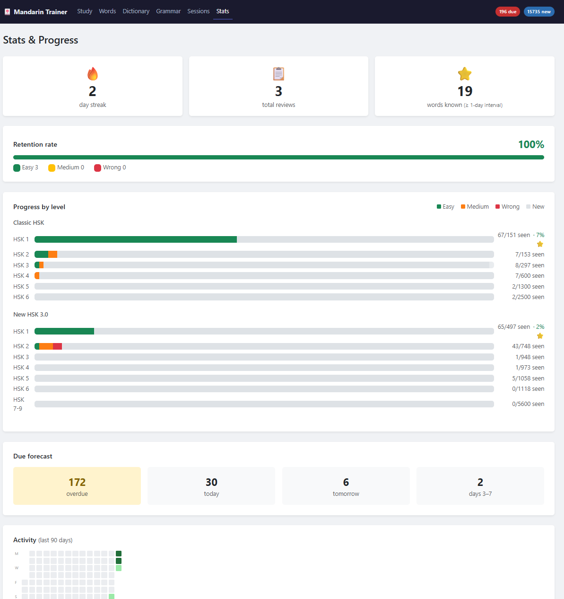
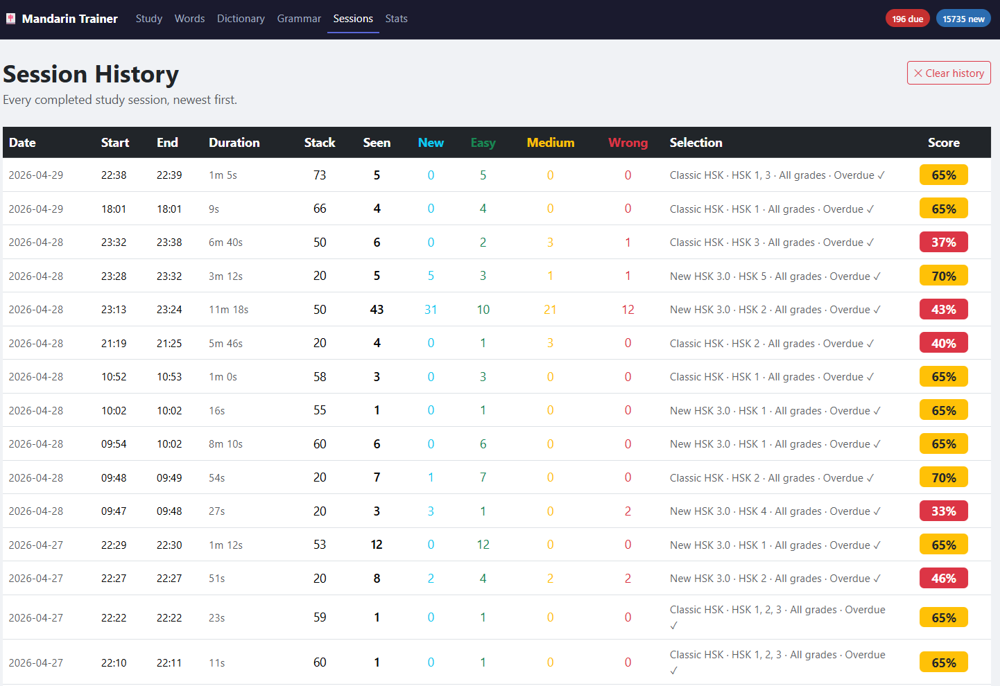

# Mandarin Trainer

A local web app for studying Mandarin Chinese vocabulary and grammar. Built with Flask and SQLite, it runs entirely on your machine — no account, no cloud, no subscription.


---

## Features

### Study (Spaced Repetition)
- Flashcard sessions using a spaced repetition system (SRS)
- Grade each card as **Easy**, **Medium**, or **Wrong** — the interval adjusts automatically
- Supports two curricula: **Classic HSK** (levels 1–6) and **New HSK 3.0** (levels 1–9)
- Study by HSK level, a custom word list, or a mix of due and new cards
- Session summary with per-grade counts and a progress bar

<div align="center">
  
  <p><em>Flashcard session with SRS intervals</em></p>
</div>

<div align="center">
  
  <p><em>Flashcard Example before grading - TTS supported</em></p>
</div>

### Word List
- Browse all vocabulary filtered by curriculum and HSK level
- Word detail modal with hanzi, pinyin, English meaning, and example sentence
- Text-to-speech playback for any word (powered by [edge-tts](https://github.com/rany2/edge-tts))
- Edit custom example sentences per word
- Track SRS progress indicators per word

<div align="center">
  
  <p><em>Word List - Example HSK</em></p>
</div>

<div align="center">
  
  <p><em>Word List - Example HSK - Flashcard View - TTS supported</em></p>
</div>

### Dictionary
- Full-text search across all words by hanzi, pinyin, or English
- Pinyin search works with or without tone marks
- Select words and add them directly to a custom list

<div align="center">
  
  <p><em>Flashcard session with SRS intervals</em></p>
</div>

### Custom Lists
- Create named word lists from any dictionary search
- Rename or delete lists from the word list view
- Study a specific list in isolation
- Reset SRS progress per list independently

### Grammar Library
- ~500 grammar points sourced from the [AllSet Learning Chinese Grammar Wiki](https://resources.allsetlearning.com/chinese/grammar/)
- Two-panel layout: collapsible sidebar with live search + inline article view
- Organised by HSK level (1–6) with an "Other" group for uncategorised entries
- Each article includes explanation, usage notes, and example sentences
- **See Also** links navigate directly to related articles or trigger a search
- Category tags filter the sidebar instantly
- Bookmark favourite articles with a star — filter to favourites only
- Grammar data sourced from [Chinese-Grammar](https://github.com/krmanik/Chinese-Grammar) and [asg](https://github.com/ivankara/asg) — thank you to the contributors of both projects

<div align="center">
  
  <p><em>Grammar Library - Sorted by HSK</em></p>
</div>

### Stats & History
- Activity calendar showing study days over the past 90 days
- Session history log with date, duration, and review counts
- Per-curriculum and per-level SRS progress breakdown

<div align="center">
  
  <p><em>Some in-depth stats for personal tracking</em></p>
</div>

<div align="center">
  
  <p><em>Session History</em></p>
</div>


### LLM Example Sentence Generation *(optional)*
When [Lemonade](https://github.com/lemonade-sdk/lemonade) is running locally, a **✨ Generate missing examples** button appears on any custom list's word view. It sends words without example sentences to the local LLM and fills them in automatically. The feature is silently unavailable when Lemonade is not running — nothing breaks.

Recommended model: `DeepSeek-Qwen3-8B-GGUF` (fast, good quality for this task).

---

## Tech Stack

| Layer | Technology |
|-------|-----------|
| Backend | Python 3.10+, Flask 3 |
| Database | SQLite (single file `vocab.db`) |
| Frontend | Bootstrap 5, vanilla JS |
| TTS | edge-tts (server-side, cached to `tts_cache/`) |
| LLM *(optional)* | Lemonade local inference server |

---

## Getting Started

**1. Clone the repository**
```bash
git clone https://github.com/trainingDay25/MandarinTrainer.git
cd mandarintrainer
```

**2. Run start.bat**

Easiest way is to use the start.bat - It will create the venv, install dependencies and start the flask server. Alternatively you can 
follow the next steps and install it manually as well.

start.bat will at the second run only launch the Mandarin Trainer

**3. Create a virtual environment and install dependencies**
```bash
python -m venv .venv
source .venv/bin/activate      # Windows: .venv\Scripts\activate
pip install -r requirements.txt
```

**4. Run the app**
```bash
python app.py
```

Open [http://localhost:5001](http://localhost:5001) in your browser.

The database (`vocab.db`) is created and populated automatically on first run.

---

## Optional: LLM Example Generation

Install and start [Lemonade](https://github.com/lemonade-sdk/lemonade), then load a compatible model (e.g. `DeepSeek-Qwen3-8B-GGUF`). The app polls `http://localhost:8000` at startup — if Lemonade is reachable, the generate button appears automatically on custom list pages.

---

## Project Structure

```
app.py                  Main Flask application
vocab.db                SQLite database (auto-created)
requirements.txt
templates/
  base.html             Navbar, layout shell
  index.html            Study session (flashcard view)
  words.html            Word list & custom list management
  dictionary.html       Search / add to list
  grammar.html          Grammar library (sidebar + article panel)
  sessions.html         Session history
  stats.html            Progress stats & activity calendar
static/
  style.css             Custom styles
tts_cache/              Cached TTS audio files (auto-created)
import_grammar.py       Import grammar data from source repos
consolidate_grammar.py  Deduplicate grammar entries
```

---

## Data Sources

- **Vocabulary**: HSK Classic (1–6) and New HSK 3.0 (1–9) word lists
- **Grammar**: [Chinese-Grammar](https://github.com/krmanik/Chinese-Grammar) and [asg](https://github.com/ivankra/asg), both based on the [AllSet Learning Chinese Grammar Wiki](https://resources.allsetlearning.com/chinese/grammar/)

---

## License

MIT
