# Mandarin & Japanese Trainer

A local web app for studying **Mandarin Chinese** and **Japanese** vocabulary and grammar. Built with Flask and SQLite, it runs entirely on your machine — no account, no cloud, no subscription.


---

## Installation

Go to the [**Releases page**](https://github.com/trainingDay25/MandarinTrainer/releases) and download the version for your platform.

### 🖥️ Desktop (Windows & macOS)

> Requires **Python 3.10 or higher** — download from [python.org](https://python.org). On Windows, tick "Add Python to PATH" during installation.

1. Download the **Desktop ZIP** from the latest release and extract it anywhere
2. **Windows:** double-click `start.bat`  
   **macOS:** open Terminal in the folder and run `chmod +x start.sh && ./start.sh`
3. On first run, all dependencies are installed automatically
4. The app opens in your browser at `http://127.0.0.1:5001`

To update to a newer release, run `update.bat` (Windows) or `./update.sh` (macOS) — your progress is preserved automatically.

### 📱 Android

1. Download **MandarinTrainer.apk** from the latest release
2. On your device, allow installation from unknown sources if prompted (Settings → Security)
3. Open the downloaded APK and tap Install

---

## Language Modes

Switch between **Chinese** and **Japanese** at any time using the flag icons in the top bar. Each language has its own vocabulary, dictionary, custom lists, and SRS progress — they never mix.

| | Chinese | Japanese |
|---|---|---|
| Curricula | Classic HSK 1–6, New HSK 3.0 L1–9 | JLPT N5–N1 |
| Writing | Simplified + Traditional + Pinyin | Kanji + Kana |
| Dictionary | CC-CEDICT (~100k entries) | 24k-entry JP dictionary |
| Kana chart | — | Hiragana & Katakana reference |

---

## Features

### Study (Spaced Repetition)
- Flashcard sessions using a spaced repetition system (SRS)
- Grade each card as **Easy**, **Medium**, or **Wrong** — the interval adjusts automatically
- **Chinese:** Classic HSK (levels 1–6) and New HSK 3.0 (levels 1–9)
- **Japanese:** JLPT N5–N1 (5 levels, ~7,900 words with example sentences)
- Cards show kanji/hanzi, reading (pinyin or kana), and English; choose what to show on the front
- Study by level, a custom word list, or a mix of due and new cards
- Session summary with per-grade counts and a progress bar

<div align="center">
  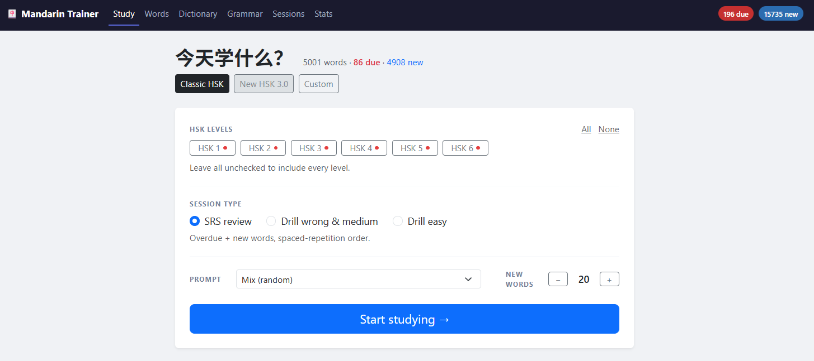
  <p><em>Flashcard session with SRS intervals</em></p>
</div>

<div align="center">
  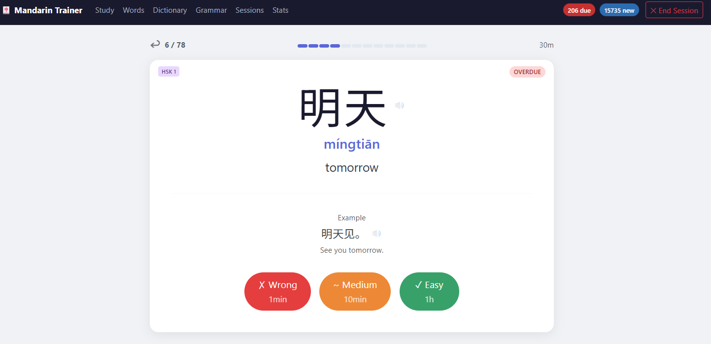
  <p><em>Flashcard Example before grading - TTS supported</em></p>
</div>

### Word List
- Browse all vocabulary filtered by curriculum and level
- Word detail modal with kanji/hanzi, reading (pinyin or kana), English meaning, and example sentence
- Text-to-speech playback for any word (powered by [edge-tts](https://github.com/rany2/edge-tts))
- Edit custom example sentences per word
- Track SRS progress indicators per word

<div align="center">
  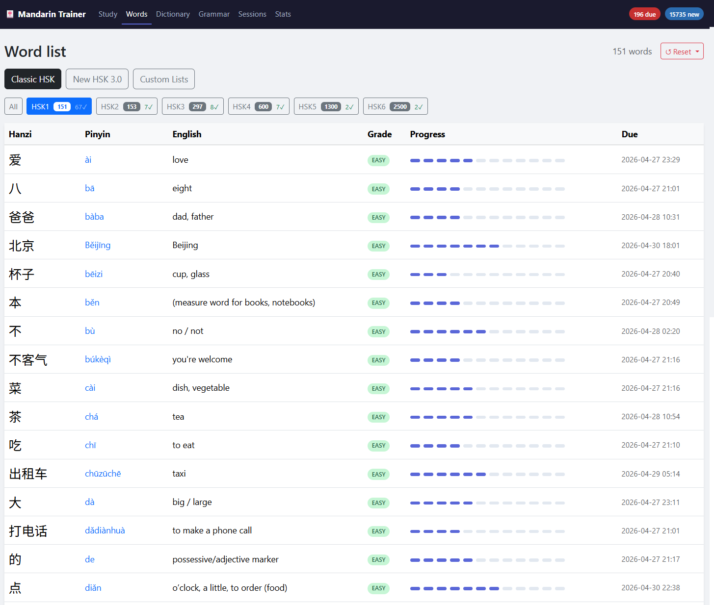
  <p><em>Word List - Example HSK</em></p>
</div>

<div align="center">
  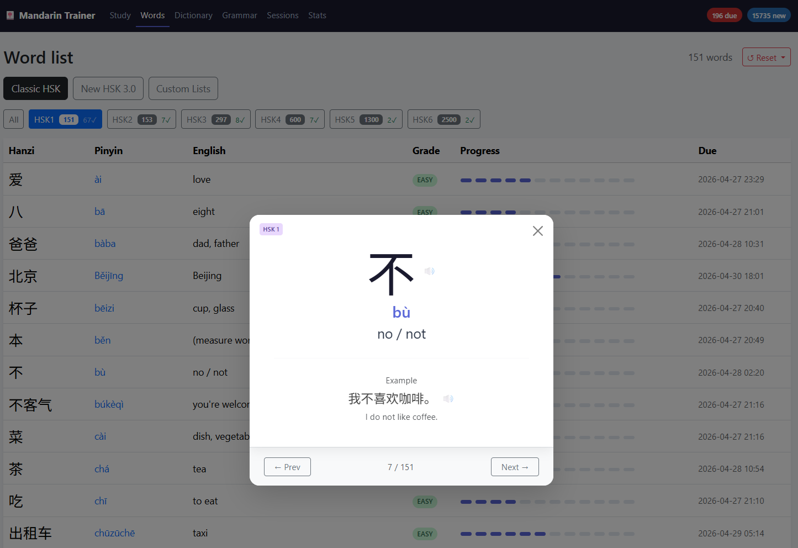
  <p><em>Word List - Example HSK - Flashcard View - TTS supported</em></p>
</div>

### Dictionary
- **Chinese:** full CC-CEDICT search by simplified/traditional hanzi, pinyin (with or without tone marks), or English
- **Japanese:** 24k-entry dictionary searchable by kanji, romanization, or English
- Select any result and add it directly to a language-specific custom list

<div align="center">
  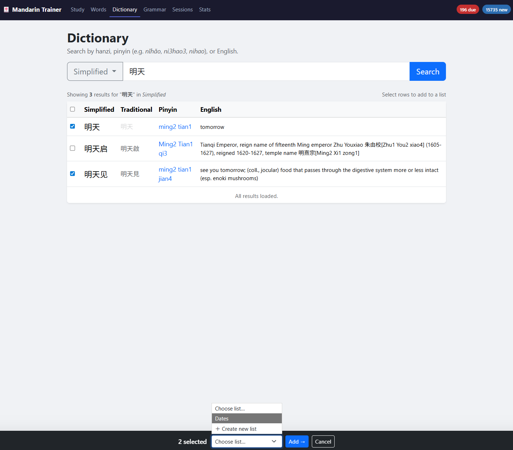
  <p><em>Dictionary with Custom List addition</em></p>
</div>

### Custom Lists
- Create named word lists from any dictionary search
- Rename or delete lists from the word list view
- Study a specific list in isolation
- Reset SRS progress per list independently

### Grammar Library *(Chinese only)*
- ~500 grammar points sourced from the [AllSet Learning Chinese Grammar Wiki](https://resources.allsetlearning.com/chinese/grammar/)
- Two-panel layout: collapsible sidebar with live search + inline article view
- Organised by HSK level (1–6) with an "Other" group for uncategorised entries
- Each article includes explanation, usage notes, and example sentences
- **See Also** links navigate directly to related articles or trigger a search
- Category tags filter the sidebar instantly
- Bookmark favourite articles with a star — filter to favourites only
- Grammar data sourced from [Chinese-Grammar](https://github.com/krmanik/Chinese-Grammar) and [asg](https://github.com/ivankara/asg) — thank you to the contributors of both projects

### Hiragana & Katakana Chart *(Japanese only)*
- Full kana reference table available under Explore → Hiragana & Katakana
- Visible only when in Japanese mode

<div align="center">
  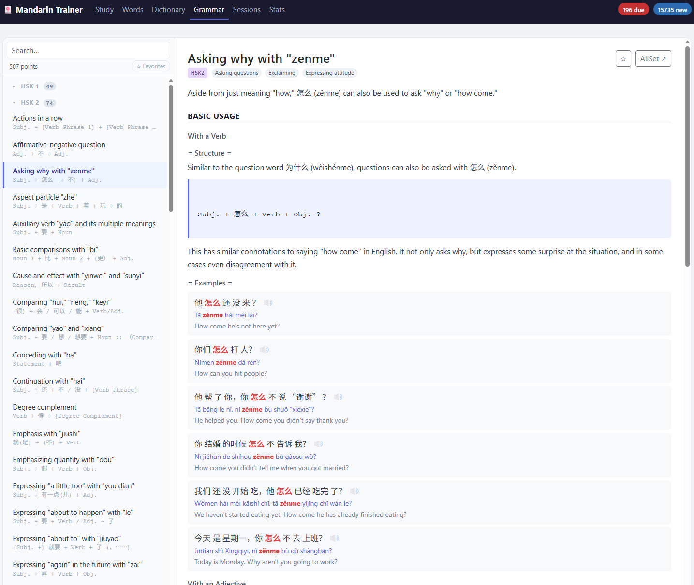
  <p><em>Grammar Library - Sorted by HSK</em></p>
</div>

### Learning Map
- Visual snake-path map through every level for all curricula (HSK Classic, New HSK, JLPT)
- 20 circles per level — each circle is a timed quiz session drawn from that level's vocabulary
- Circles are colour-coded: **green ✓** (passed), **blue** (unlocked), **grey 🔒** (locked)
- Passing threshold rises from 75 % on circle 1 to 94 % on circle 20 (+1 % per circle)
- Best score and attempt count shown on hover; progress resets independently per curriculum
- Decorative pagoda, lantern, and level-seal elements mark level boundaries

<div align="center">
  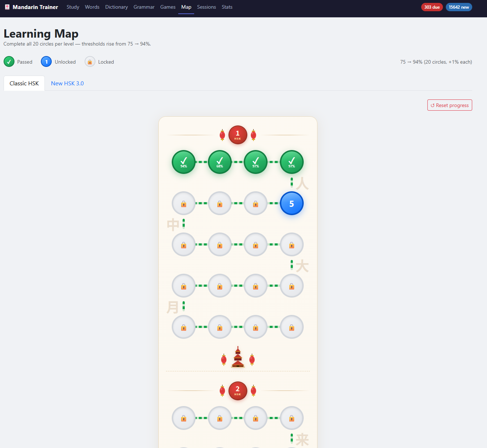
  <p><em>Game Map Oview - Locked, Unlocked Stages</em></p>
</div>

### Games
Six mini-games for varied practice, playable freely or directly from the Learning Map:

| Game | Description |
|------|-------------|
| 🔊 **Audio Bingo** | Hear a word via TTS and tap the matching character on a grid |
| 🎵 **Tone ID** | Identify the tone of a spoken syllable *(Chinese only)* |
| 🃏 **Match Pairs** | Flip cards to match kanji/hanzi with their English meaning |
| 📝 **Multiple Choice** | Choose the correct translation (character → English or English → character) |
| ✍️ **Draw Hanzi/Kanji** | Trace characters with practice or test mode |
| 🔀 **Scrambled** | Reassemble a shuffled sentence — uses word-level tiles for Chinese (jieba), alternating kanji/kana runs for Japanese |

All games share a common settings bar (curriculum + level filter) and integrate with the Learning Map progress tracker.

<div align="center">
  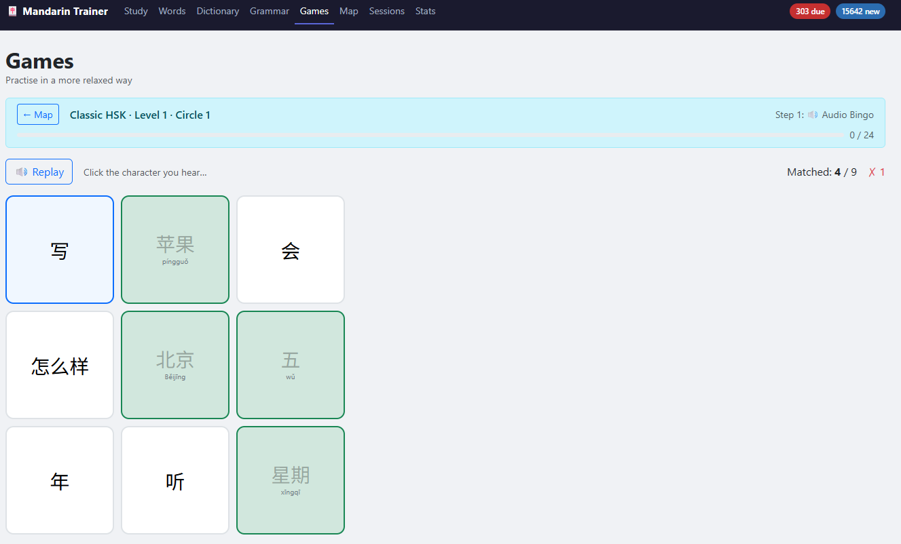
  <p><em>Game Tone Bingo</em></p>
</div>

<div align="center">
  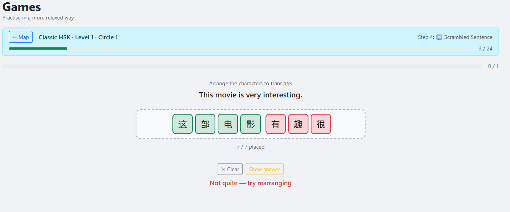
  <p><em>Game Sentence Scramble</em></p>
</div>

<div align="center">
  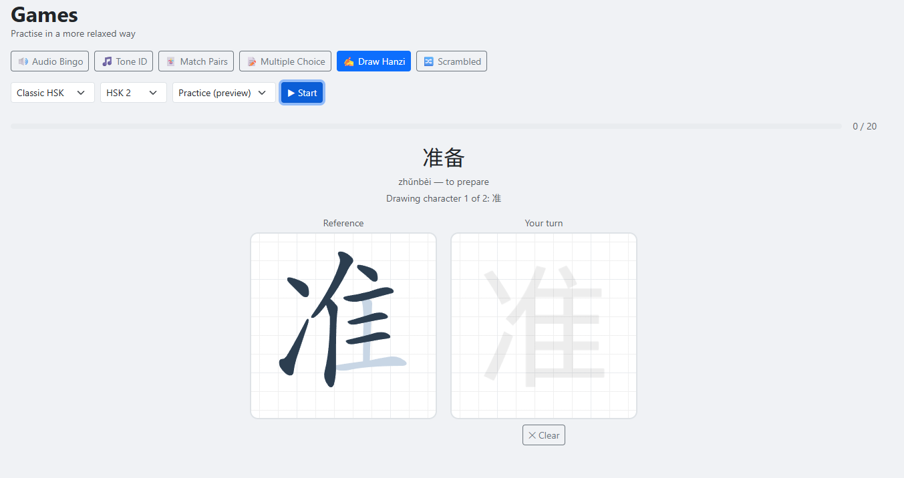
  <p><em>Game Draw Hanzi (Practice and Test)</em></p>
</div>

### Awards
- 43 achievements across 6 categories: flashcard reviews, words learned, day streaks, level mastery, map progress, and explorer milestones
- Awards are granted automatically as you study — no need to visit the awards page
- Earned awards are included in progress exports and restored on import

### Stats & History
- Activity calendar showing study days over the past 90 days
- Session history log with date, duration, and review counts
- Per-curriculum and per-level SRS progress breakdown
- Recent awards snapshot on the stats page

<div align="center">
  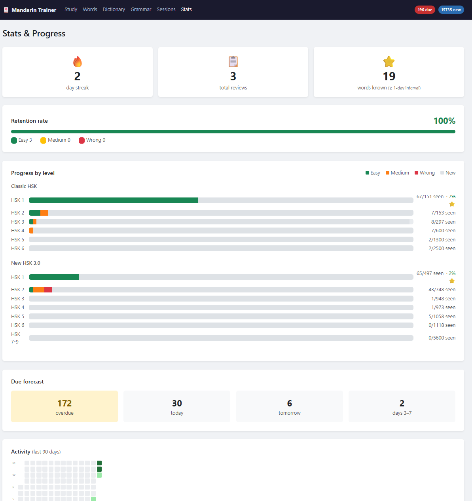
  <p><em>Some in-depth stats for personal tracking</em></p>
</div>

<div align="center">
  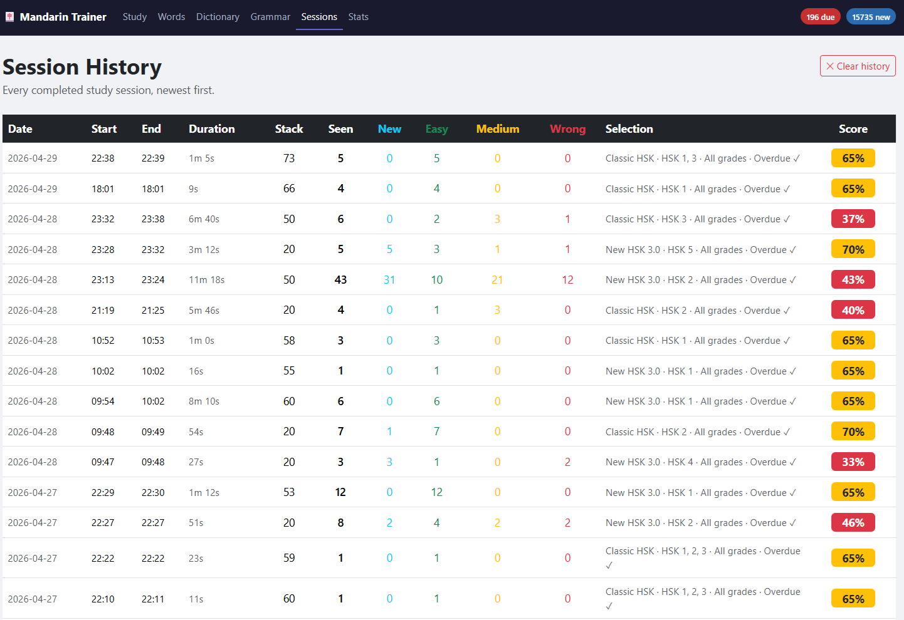
  <p><em>Session History</em></p>
</div>


### LLM Example Sentence Generation *(optional)*
When [Lemonade](https://github.com/lemonade-sdk/lemonade) is running locally, a **✨ Generate missing examples** button appears on any custom list's word view. It sends words without example sentences to the local LLM and fills them in automatically. The feature is silently unavailable when Lemonade is not running — nothing breaks.

Recommended model: `DeepSeek-Qwen3-8B-GGUF` (fast, good quality for this task).

---

## Tech Stack

| Layer | Technology |
|-------|-----------|
| Backend | Python 3.10+, Flask 3 |
| Database | SQLite (single file `vocab.db`) |
| Frontend | Bootstrap 5, vanilla JS |
| TTS | edge-tts (server-side, cached to `tts_cache/`) |
| LLM *(optional)* | Lemonade local inference server |

---

## Optional: LLM Example Generation

Install and start [Lemonade](https://github.com/lemonade-sdk/lemonade), then load a compatible model (e.g. `DeepSeek-Qwen3-8B-GGUF`). The app polls `http://localhost:8000` at startup — if Lemonade is reachable, the generate button appears automatically on custom list pages.

---

## Project Structure

```
app.py                  Main Flask application entry point
requirements.txt        Python dependencies
start.bat / start.sh    Launch script (Windows / macOS)
update.bat / update.sh  Updater script (Windows / macOS)
src/mandarin_trainer/
  server.py             Flask routes and all application logic
  templates/
    base.html           Navbar, layout shell
    index.html          Study session (flashcard view)
    map.html            Learning Map (snake-path progression)
    game.html           Mini-games hub (Audio Bingo, Tone ID, Match, MC, Draw, Scrambled)
    words.html          Word list & custom list management
    custom.html         Custom lists overview
    dictionary.html     Search / add to list
    grammar.html        Grammar library (sidebar + article panel)
    sessions.html       Session history
    stats.html          Progress stats & activity calendar
    awards.html         Awards & achievements
  static/
    style.css           Custom styles
vocab.db                SQLite database — created on first run, not included in repo
tts_cache/              Cached TTS audio files (auto-created)
```

---

## Data Sources

- **Chinese vocabulary**: HSK Classic (1–6) and New HSK 3.0 (1–9) word lists
- **Japanese vocabulary**: JLPT N5–N1 word lists (~7,900 words) with hand-written example sentences
- **Japanese dictionary**: 24k-entry kanji/word dictionary with romanization and English translations
- **Chinese dictionary**: [CC-CEDICT](https://www.mdbg.net/chinese/dictionary?page=cedict) (~100k entries)
- **Grammar**: [Chinese-Grammar](https://github.com/krmanik/Chinese-Grammar) and [asg](https://github.com/ivankra/asg), both based on the [AllSet Learning Chinese Grammar Wiki](https://resources.allsetlearning.com/chinese/grammar/)

---

## License

MIT
